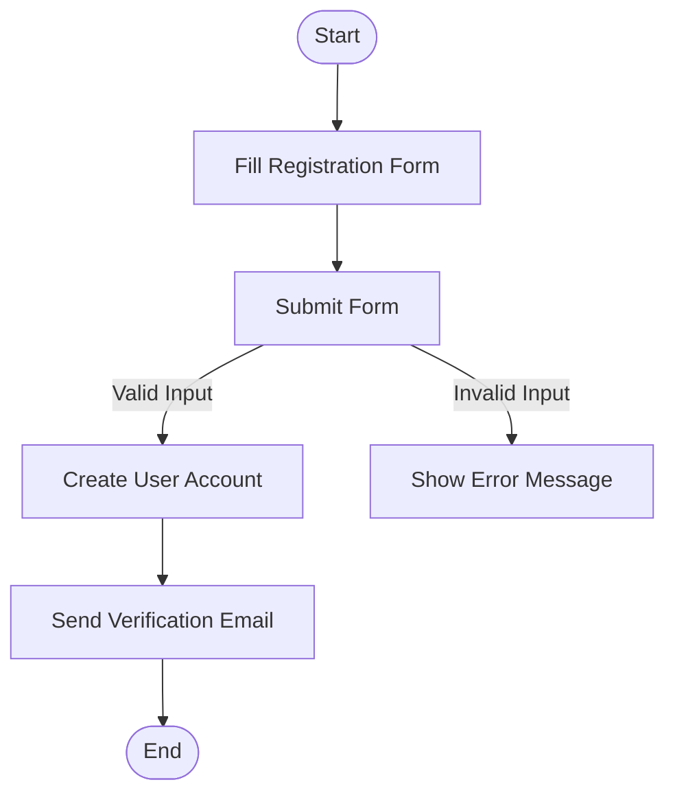
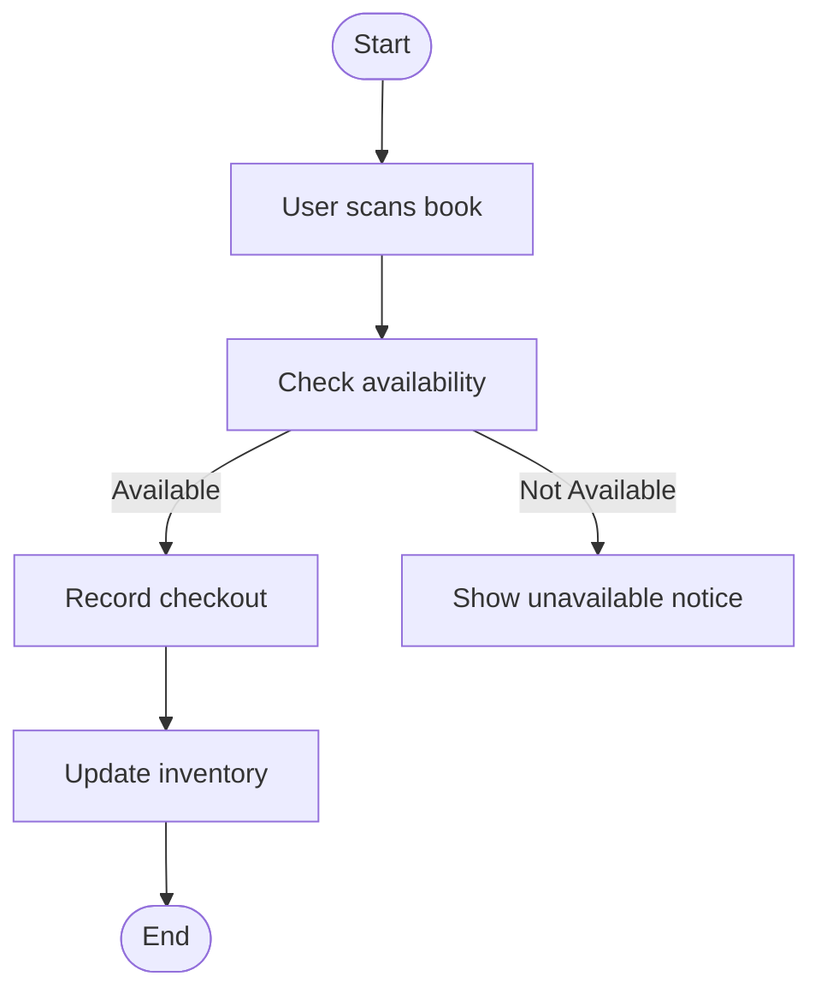
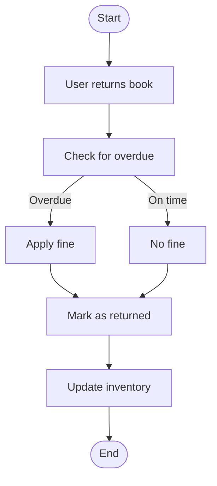
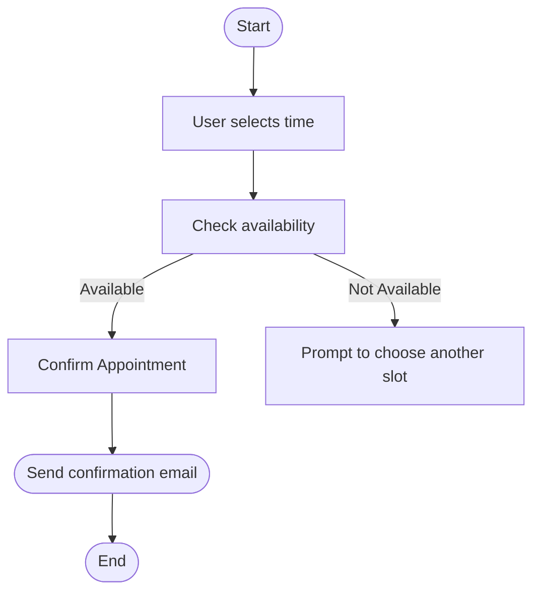
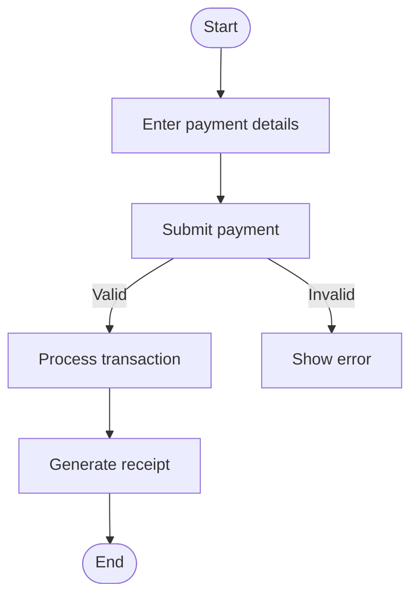
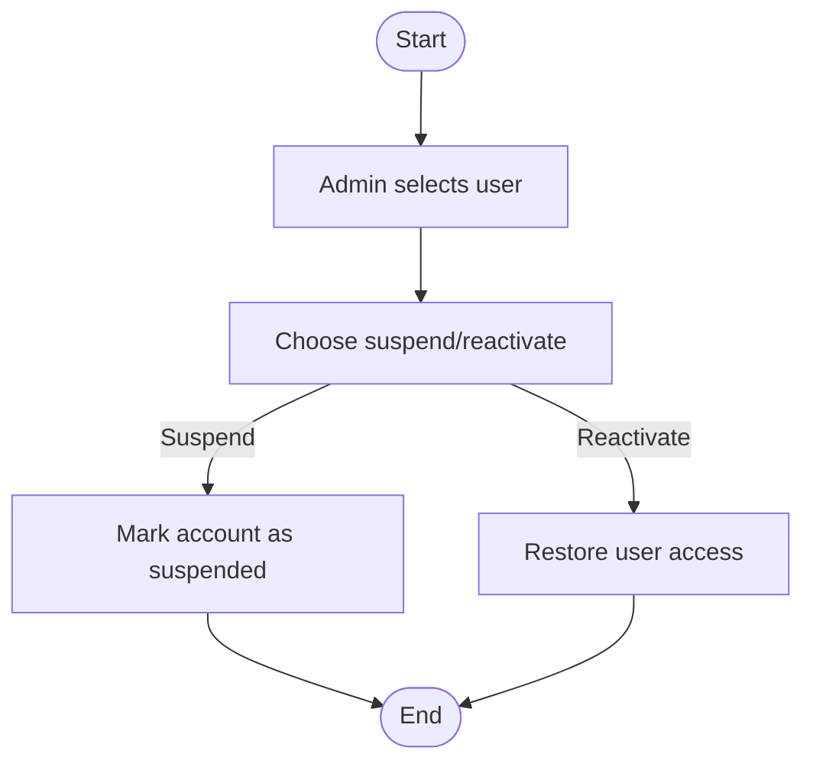
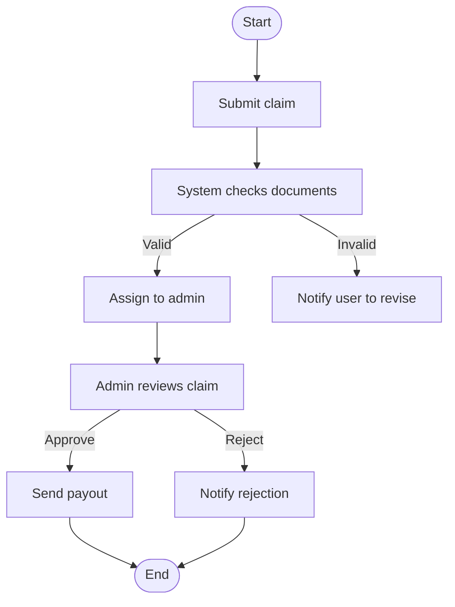
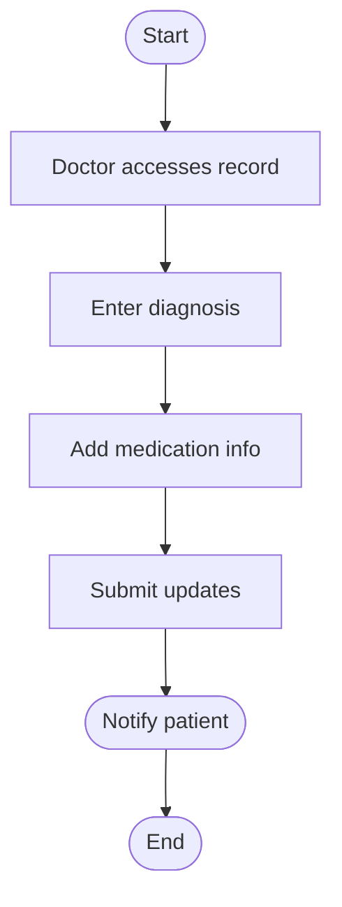

# 🌀 Activity Workflow Modeling with Activity Diagrams

This section illustrates 8 complex workflows from the system using UML activity diagrams in Mermaid format. Each includes swimlanes, decision nodes, and parallel actions, with markdown explanations.

---

## 1️⃣ User Registration

**Explanation:** This diagram represents the user registration process. It ensures input validation and email confirmation — addressing stakeholder concern for secure onboarding.

---

## 2️⃣ Book Checkout

**Explanation:** This workflow covers book checkout. Inventory update ensures stock reflects real-time borrowing — a key librarian requirement.

---

## 3️⃣ Process Return

**Explanation:** This ensures overdue fines are handled accurately, meeting the admin's billing policies.

---

## 4️⃣ Appointment Scheduling

**Explanation:** Ensures users cannot double-book appointments — critical for resource management.

---

## 5️⃣ Payment Workflow

**Explanation:** Guarantees user is notified of success/failure, crucial for financial transparency.

---

## 6️⃣ Account Suspension & Reactivation

**Explanation:** Provides admin control over account status, addressing risk and moderation concerns.

---

## 7️⃣ Insurance Claim Review

**Explanation:** Efficiently splits claim handling between system and admin to reduce processing time.

---

## 8️⃣ Medical Record Update

**Explanation:** Ensures timely patient communication and proper history tracking for future care quality.

---
  🔙 [Back to Main Menu](./README.md)
