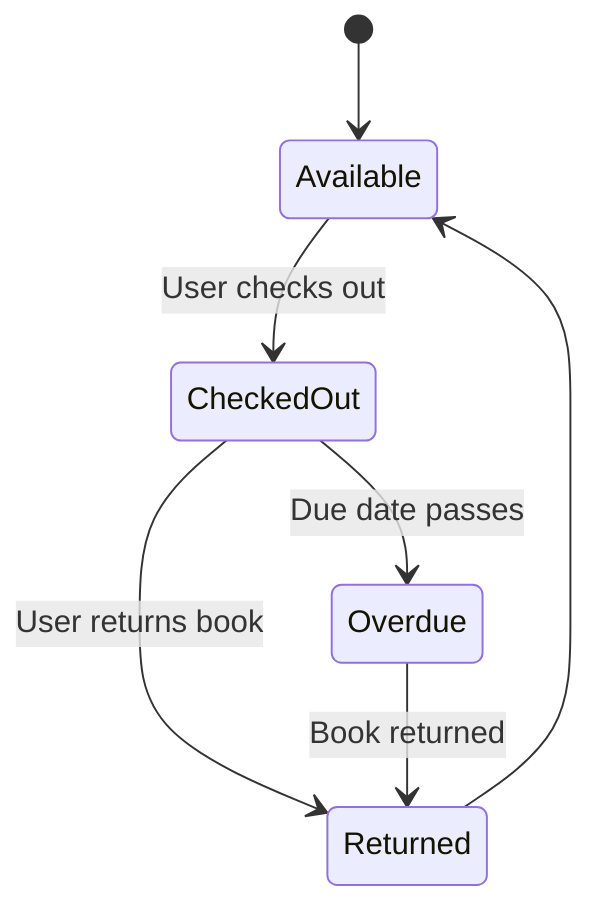
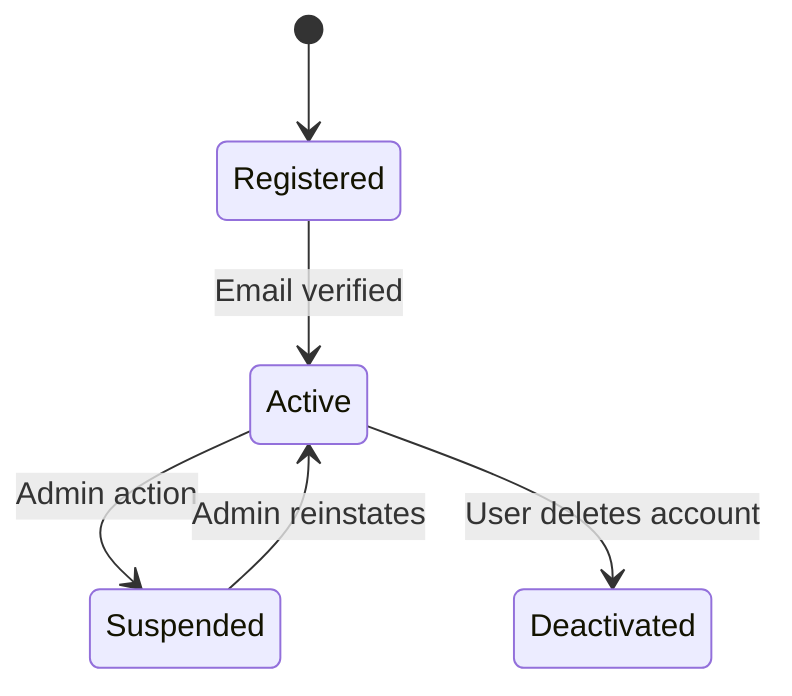
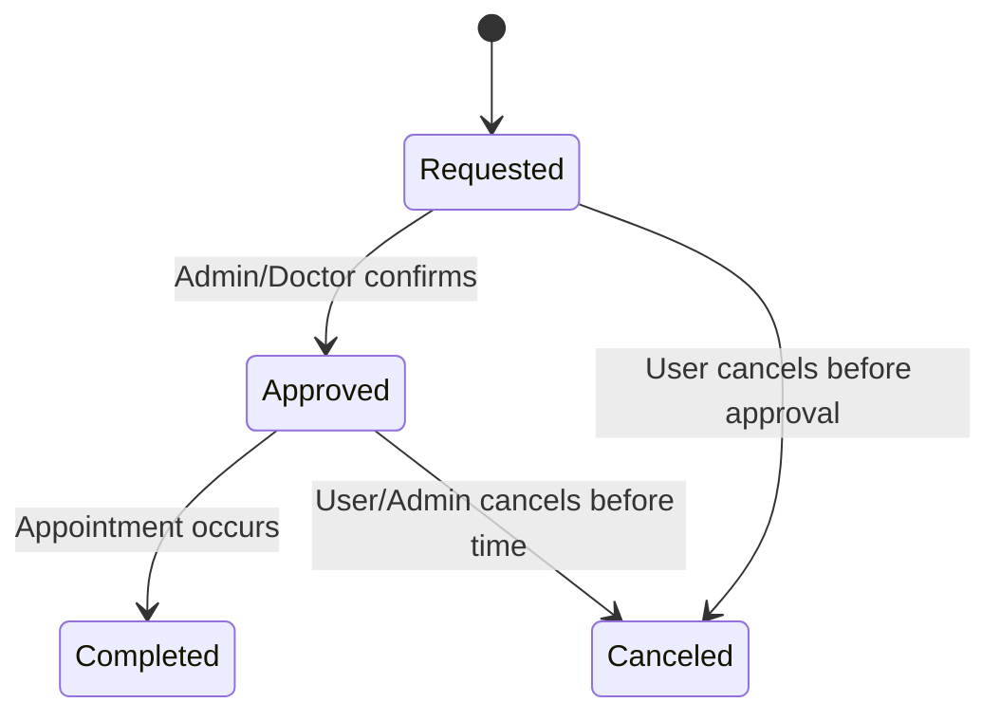
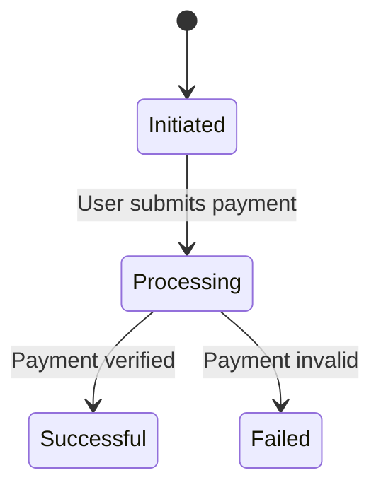
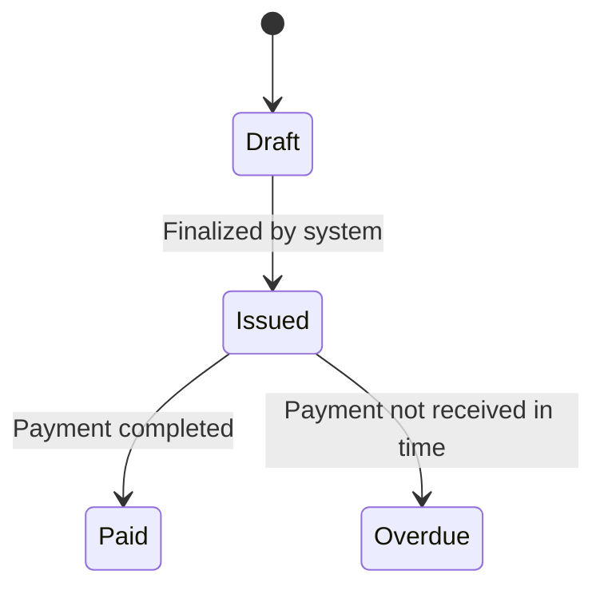
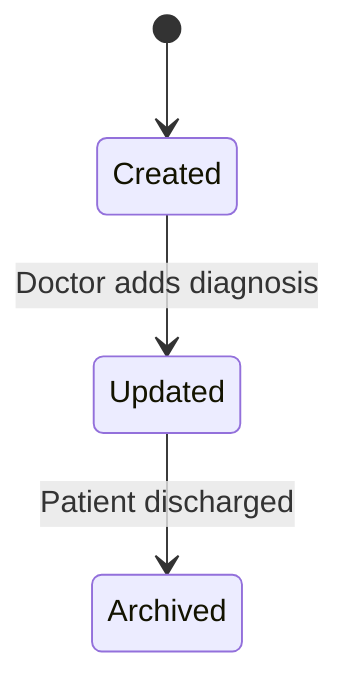
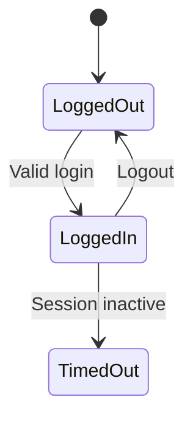
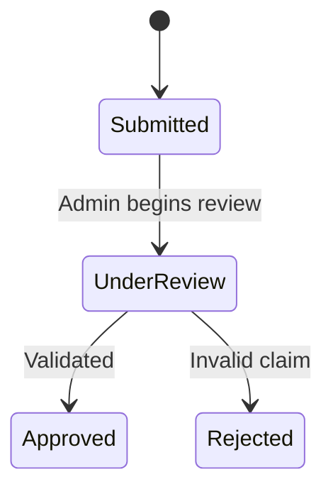

# 📊 Object State Modeling with State Transition Diagrams

This section includes UML-compliant state transition diagrams for 8 critical objects in our system. Each diagram is followed by an explanation highlighting key states, transitions, and alignment with functional requirements.

---

## 1️⃣ Book

**Explanation:**
- **States:** Available, CheckedOut, Returned, Overdue
- **Transitions:** Triggered by checkout, return, and overdue status.
- **Functional Requirement Mapping:**
  - FR-002: User checks out a book.
  - FR-003: User returns a book.
  - FR-006: System marks books as overdue if return is late.

---

## 2️⃣ User Account

**Explanation:**
- **States:** Registered, Active, Suspended, Deactivated
- **Transitions:** Based on email verification, user/admin actions.
- **Functional Requirement Mapping:**
  - FR-001: User registration.
  - FR-009: Admin can suspend/reactivate users.

---

## 3️⃣ Appointment

**Explanation:**
- **States:** Requested, Approved, Completed, Canceled
- **Transitions:** Requesting, approving, cancelling, and completing appointments.
- **Functional Requirement Mapping:**
  - FR-004: Schedule appointment.
  - FR-005: Cancel appointment before approval.
  - FR-008: Complete scheduled appointments.

---

## 4️⃣ Payment

**Explanation:**
- **States:** Initiated, Processing, Successful, Failed
- **Transitions:** Based on payment events and outcomes.
- **Guard Condition:** Only if payment is valid → transition to Successful.
- **Functional Requirement Mapping:**
  - FR-010: Process user payments.

---

## 5️⃣ Invoice

**Explanation:**
- **States:** Draft, Issued, Paid, Overdue
- **Transitions:** Issuing, paying, or overdue tracking.
- **Functional Requirement Mapping:**
  - FR-011: System generates and tracks invoices.

---

## 6️⃣ Medical Record

**Explanation:**
- **States:** Created, Updated, Archived
- **Transitions:** Managed by medical professionals.
- **Functional Requirement Mapping:**
  - FR-012: Add/update medical history.
  - FR-014: Archive records after discharge.

---

## 7️⃣ User Session

**Explanation:**
- **States:** LoggedOut, LoggedIn, TimedOut
- **Transitions:** Triggered by login/logout or inactivity.
- **Functional Requirement Mapping:**
  - FR-015: Manage session timeout and user login.

---

## 8️⃣ Insurance Claim

**Explanation:**
- **States:** Submitted, UnderReview, Approved, Rejected
- **Transitions:** Based on admin evaluation.
- **Guard Condition:** Only valid claims can transition to Approved.
- **Functional Requirement Mapping:**
  - FR-016: Insurance processing functionality.

---
  🔙 [Back to Main Menu](./README.md)
