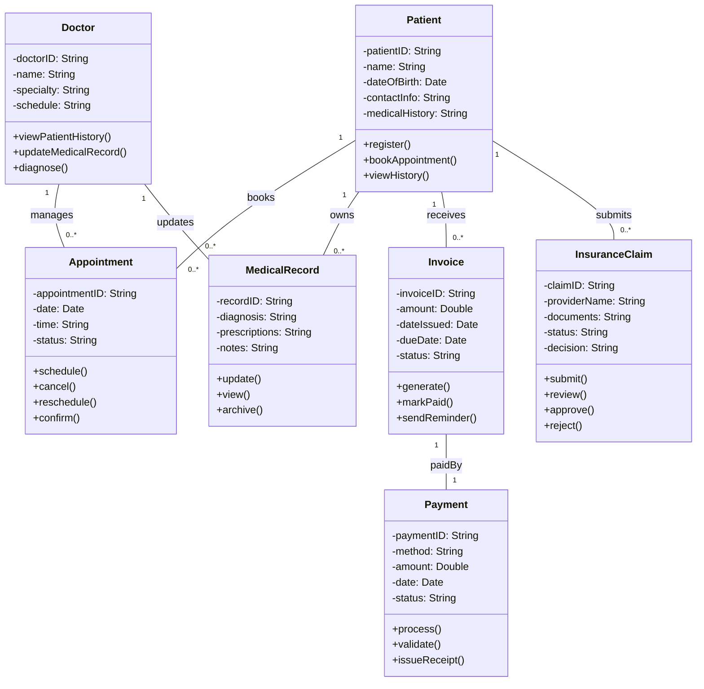

# 🧱 Class Diagram (Mermaid.js)

This Mermaid.js class diagram represents the core domain entities of the Hospital Information Management System (HIMS), their attributes, methods, and interrelationships including multiplicity, composition, and association.

---

## 📌 Explanation of Key Design Decisions

- **Composition & Multiplicity**: 
  - A `Patient` can book many `Appointments`, but each `Appointment` belongs to one `Doctor` and one `Patient`.
  - `Invoice` and `Payment` are tightly coupled—each invoice must be associated with a payment.
  - `MedicalRecord` is owned by `Patient` but updated by `Doctor`, reflecting the real-world collaboration.

- **Encapsulation**:
  - Attributes are marked private (`-`) to maintain encapsulation.
  - Methods are public (`+`) for entity interaction.

- **System Alignment**:
  - Matches the functional requirements (e.g., booking, diagnosis, billing).
  - Reflects activities and state transitions such as payment processing, record updates, and appointment workflows.
 
  ---
  🔙 [Back to Main Menu](./Assignment9.md)
